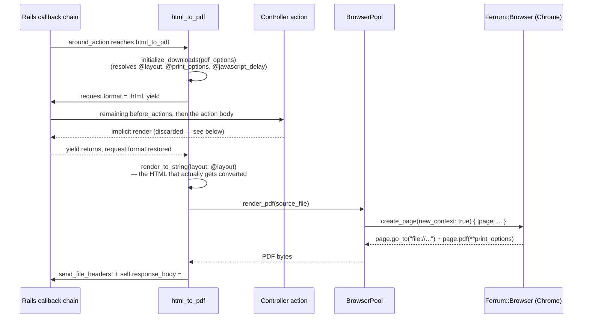
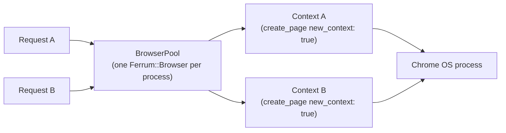

# HtmlToPdf architecture

[← Back to README](../README.md)

## Why headless Chrome instead of wkhtmltopdf

wkhtmltopdf renders with a frozen, years-out-of-date WebKit build — no flexbox fixes, no CSS Grid,
no modern font handling, and the upstream project has been unmaintained for years. Headless Chrome
is the actual rendering engine your users browse your app with, kept current by Chrome's own
release cycle, so "what the PDF looks like" and "what the page looks like in a browser" stop being
two different questions. The tradeoff is the dependency: a real Chrome/Chromium install instead of
a single static binary. See [Rails integration](rails-integration.md#production-deployment-chrome-in-docker)
for what that costs you in a container image.

## Request lifecycle

For one `GET /widgets/1.pdf` request, with `include HtmlToPdf` + `around_action :html_to_pdf` on
the controller:

The forced-`:html` `yield` is the load-bearing part of this design, and the reason this is an
`around_action` rather than a `before_action`: it lets the *rest* of the callback chain and the
action run in their normal place — any other `before_action` (a `set_record`-style one, say) runs
exactly where it always would, with its instance variables available by the time
`render_to_string` runs afterward. Format is forced to `:html` for the `yield` only so Rails'
*own* implicit-render machinery resolves the actual `.html.erb` template instead of raising
`UnknownFormat` for a `.pdf` template that doesn't exist — that render's output is thrown away;
`render_to_string`, called after format is restored, is what actually gets written to disk and
converted. See [The DoubleRenderError trap](https://ramlaxmanyadav.github.io/htmlToPdf/rails-double-render-pdf.html)
for the bug this design replaced and exactly why the obvious-looking alternative doesn't work.

## BrowserPool

Launching Chrome costs several hundred milliseconds, so `HtmlToPdf::BrowserPool` keeps one
`Ferrum::Browser` alive per Ruby process (lazily started on first use, guarded by a `Mutex` for
the memoization itself — not for every command; Ferrum's own CDP client assigns command IDs under
its own mutex and matches responses by ID, so concurrent `with_page` calls from multiple Puma
threads are safe to issue against the one shared browser). Every call still gets `create_page(new_context:
true) { |page| ... }` — a fresh, isolated browser context (separate cookies/storage/cache) per
conversion, disposed automatically when the block returns. That block form matters: calling
`create_page(new_context: true)` *without* a block and closing the page yourself leaks the context
— Ferrum only disposes it in the `ensure` attached to the block form.

If a command raises `Ferrum::DeadBrowserError`, `ProcessTimeoutError`, `TimeoutError`, or
`NoSuchPageError` (Chrome crashed or stopped responding), `BrowserPool` quits the dead browser,
drops the memoized reference, and retries the whole `with_page` call once against a freshly
launched browser before giving up and re-raising.

**Scaling note:** this is one Chrome process per Ruby process, not per request. That's the right
tradeoff for the common case (a web app rendering PDFs on demand), but it does mean every thread in
that process shares one browser — a page that hangs indefinitely ties up that shared resource for
everyone until Ferrum's own timeout fires. If you're rendering PDFs at high, sustained concurrency,
that's a capacity ceiling worth knowing is there rather than discovering under load.

## print_options and security

`HtmlToPdf::PrintOptions.build` is the one place `pdf_options` (a request-param-shaped hash) turns
into the keyword arguments handed to `Ferrum::Page#pdf` / Chrome's `Page.printToPDF`. Precedence,
highest first: `pdf_options[:print_options]`, then `pdf_options[:padding]`, then
`config.default_options` — each source is resolved (paper `:format` → `:paper_width`/
`:paper_height`, unit conversion) independently before merging, so a gem-wide default can't
silently clobber an explicit per-request value for the same underlying dimension.

Chrome's print options are a fixed, narrow set of layout flags — margins, paper size, scale — with
one deliberate exception: `header_template`/`footer_template` are raw HTML Chrome renders as-is.
See [Security](security.md) for why those two keys are filtered out of request-supplied
`print_options` by default, and what `config.allow_request_templates` actually opts you into.
